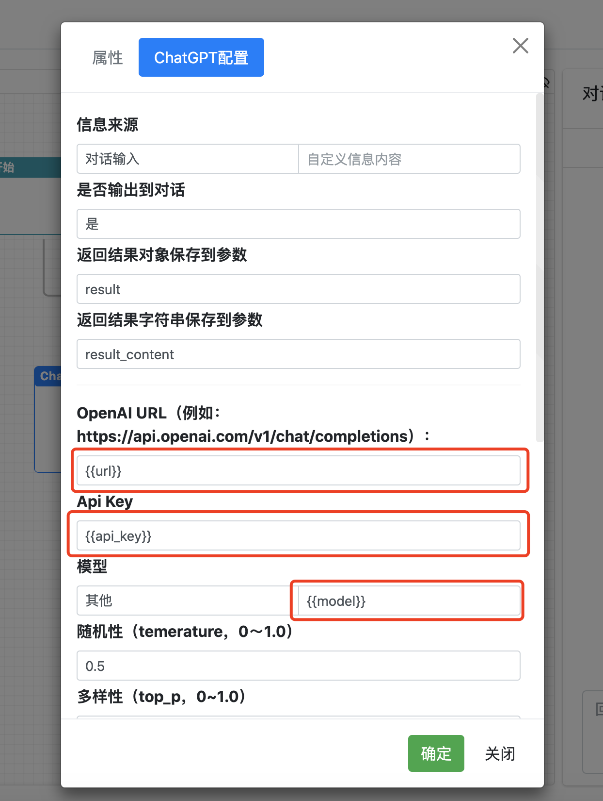

# 简介
ChatFlow 一个基于流程引擎实现的对话系统，可以整合ChatGPT等大语言模型以及业务系统API的能力，实现大语言模型在具体业务场景落地使用。使用流程设计的方式实现快速设计、快速响应需求。


提供windows 、linus和mac 的amd64版本下载。

关注公众号，回复"chatflow" 获取下载地址


# 以下是系统的使用说明：

# 1.系统配置与启动

## 1.1系统配置

系统配置文件 conf/app.conf

```
#配置端口号
httpport = 8088

#配置系统管理，登录用户名密码等
[admin]
#login username
username = "admin"
# md5 of 32bit 默认密码123456
password =  "E10ADC3949BA59ABBE56E057F20F883E"
#login page
login_html = "login.html"
```
## 1.2 启动
    执行chatflow应用程序。
    在浏览器中输入http://localhost:8088/chatflow
    默认登录用户名admin密码123456


# 2.流程定义
## 2.1流程参数

在流程设计的参数页配置执行流程所需要传输的参数。


## 2.2节点参数模板表达 

在流程节点配置的参数中都可以使用模板表达式，在流程执行过程中通过参数进行传递。

模板表达式的格式为：{{参数名}}



## 2.3节点脚本


节点属性有三个可执行脚本，包括事前、事后以及异常。脚本语言采用javascript。

* 事前脚本
事前就是在节点执行之前先执行脚本，根据返回值判断是否继续执行，

return 1; 表示继续执行

return 0; 表示不继续

* 事后脚本

在执行完节点功能之后继续执行事后脚本。

* 异常脚本

在节点执行出现异常之后会跳过事后脚本改为执行异常脚本。


<b> 脚本函数 </b>

消息操作

```
var msg = getMessage(); //获取当前聊天的用户消息。 
sendWaiting("提示信息"); //发送等待提示 
sendMessage("消息"); //发送消息

```

参数操作
```
setParam(key,value);//设置参数
var value = getParam(key);//获取参数

```

JSON操作
```
var obj = json.parse(str);  //解析json字符串
var str = json.stringfy(obj); //对象转Json字符串

```
字符串操作
```
strings.indexOf(str, substr);//获取子字符串所在位置
strings.substr(str, begin,end); //截取字符串

strings.trim(str); //去掉字符串前后空格


```

base64编码
```
var b = base64.decodeToByte(str); 解析base64字符串转byte[]

var str = base64.decodeToString(str); 解析base64字符串转string

var b = base64.encodeToByte(b); 将字节码编码为base64字节码

var str = base64.encodeToString(str); 将字节码编码为base64字符串

```

md5编码
```
var str = md5(str); 转MD5

```


# 3.WEB端使用

http://localhost:8088/chatflow/chat


# 4.API 调用
## 4.1 http接口
    http://localhost:8088/chatflow/im/chat

<b> (1) 请求 </b>

method: post

body:
```
{
    "flow_code":"797aaad2d21940269cb389475689d3b4",
    "user_id":"123456",
    
    "params":{"url":"https://api.openai.com/v1/chat/completions",
        "model":"gpt-3.5-turbo", 
        "api_key":"",
        "cosplay":"你是一名PPT制作经验丰富的高手，你擅长编写PPT文档。"
        },
    "content":"你好",
    "stream":true
}
```

其中：
flow_code： 流程编码。
user_id：用于唯一标示用户，记录用户历史会话，记忆上下文。
params：执行参数，这在设计流程的时候就明确哪些参数需要传输
content： 消息
stream： 是否流式输出


<b> (2) 返回 </b>

* 流式传输的返回为： 

```

data: {}

data: {}

data: {}

[DONE]

```

每一条消息的JSON格式如下：

```
{
    "request_Id": "f24b4d5d82354eb78cfe2846559a3cac",
    "flow_code": "797aaad2d21940269cb389475689d3b4",
    "session_id": "123456797aaad2d21940269cb389475689d3b4",
    "user_id": "123456",
    "message_id": "e23586fc370346cda9eb90a99dc829fa",
    "message_type": "message",
    "role": "assistant",
    "params": null,
    "content": "助",
    "format": "text",
    "stream": false,
    "code": 0,
    "index": 0,
    "send_time": 1692682750485,
    "finish": "no"
}
```

* 非流式传输的返回：
```
[{
    "request_Id": "f24b4d5d82354eb78cfe2846559a3cac",
    "flow_code": "797aaad2d21940269cb389475689d3b4",
    "session_id": "123456797aaad2d21940269cb389475689d3b4",
    "user_id": "123456",
    "message_id": "e23586fc370346cda9eb90a99dc829fa",
    "message_type": "message",
    "role": "assistant",
    "params": null,
    "content": "助",
    "format": "text",
    "stream": false,
    "code": 0,
    "index": 0,
    "send_time": 1692682750485,
    "finish": "no"
},
......

]
```


## 4.2 websocket接口
    ws://localhost:8088/chatflow/im/conn

使用websocket进行对话和API类似，对话过程中可根据接收到的消息，进行前段处理。

message_type的类型包括：message 、runtime、session、waiting、system等。

其中：

* message为消息内容；
* runtime为运行时状态；
* session为会话状态；
* waiting为等待提示；
* system为系统消息；
